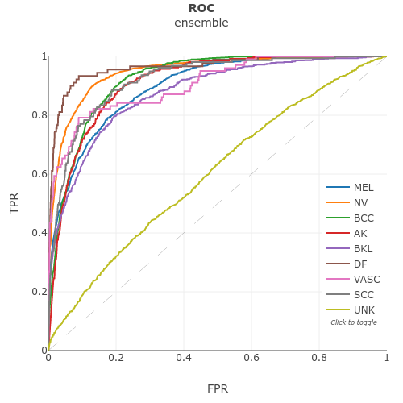
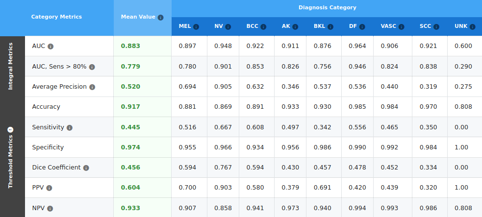

# Skin Lesion Analysis Towards Melanoma Detection

Live leaderboard at https://challenge2019.isic-archive.com/live-leaderboard.html (2019: Lesion Diagnosis).

Ensemble of 3 classifiers performs at 0.583 Overall Score, 0.850 Validation Score.

If GitHub is unable to render the Jupyter notebooks you can view them here:

https://nbviewer.jupyter.org/github/j05t/lesion_detection/blob/master/isic_classifier.ipynb

https://nbviewer.jupyter.org/github/j05t/lesion_detection/blob/master/ensembling.ipynb
